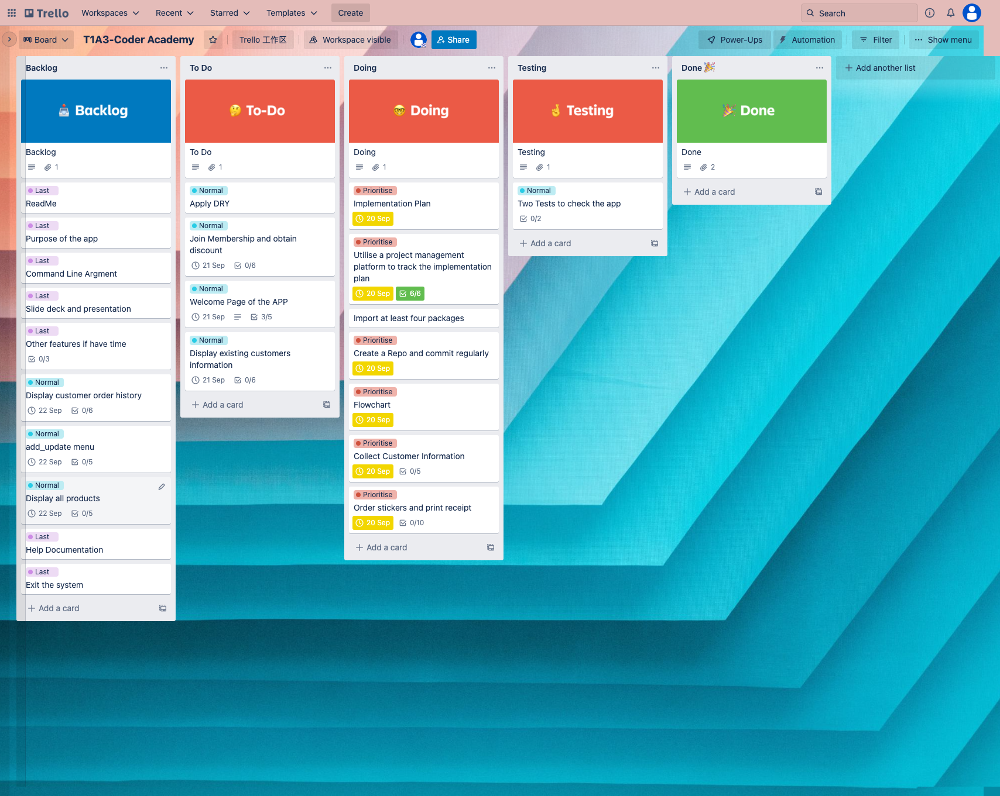
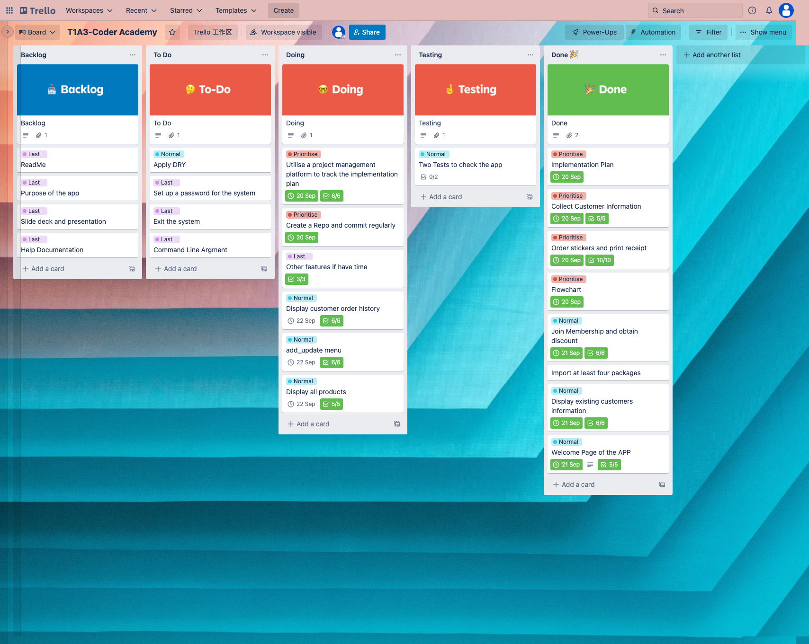
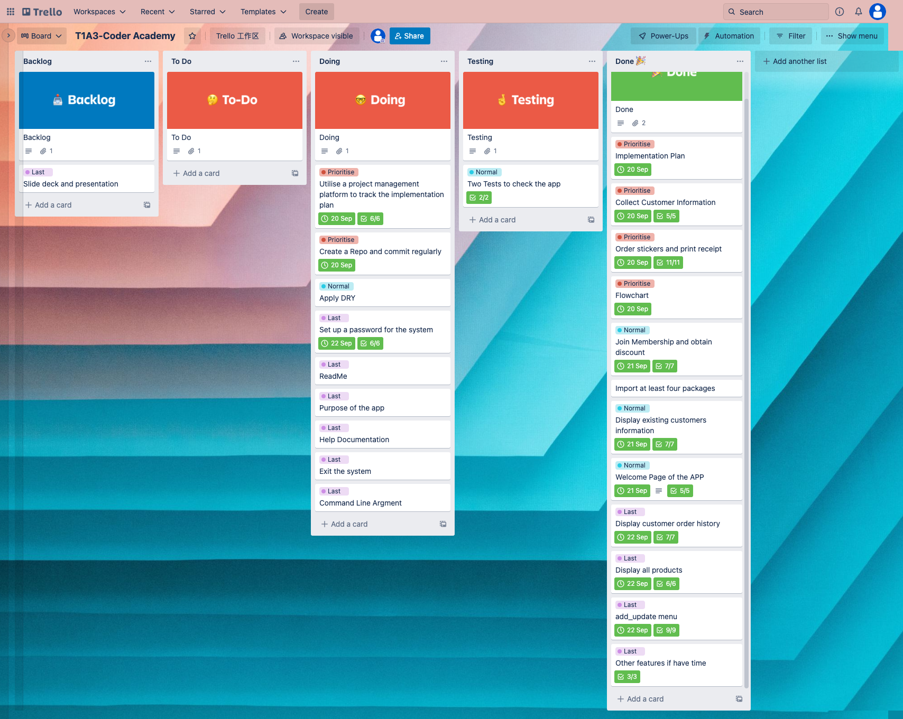
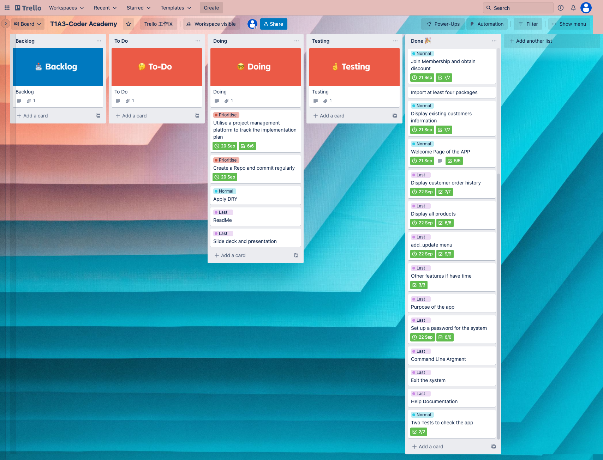
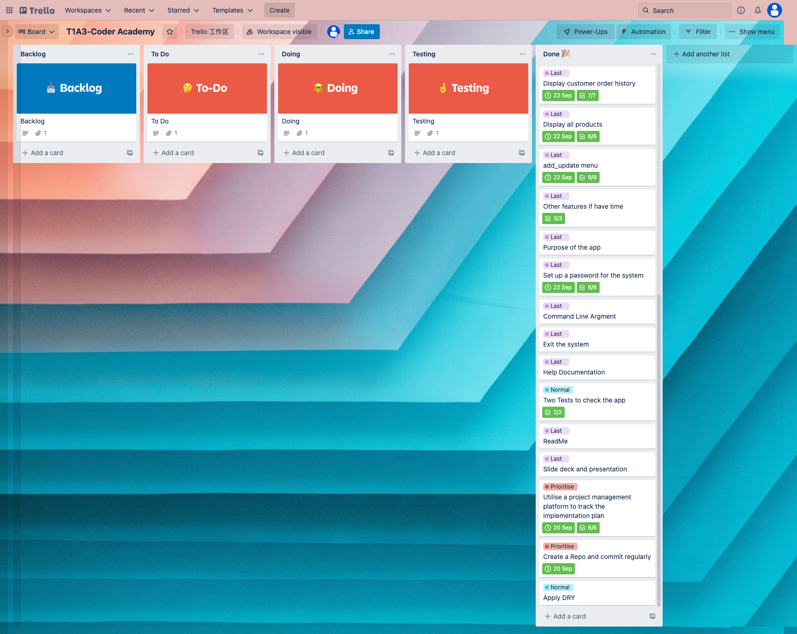
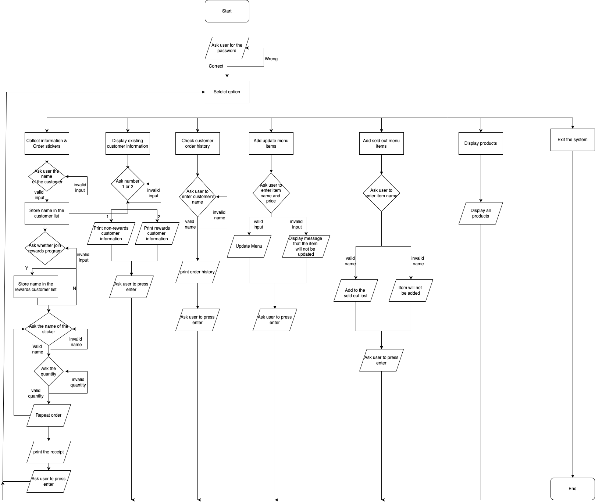

# Terminal Application Documentation

**[Link to the GitHub Repository](https://github.com/Chengqunniu/T1A3)**

**[Link to the presentation](https://www.youtube.com/watch?v=22Z0mmINPdI&t=1s)**

## Purpose of the app and list of features

---
The aim of this application is to develop an order system for a sticker shop. This system contains several features:

* Collect customer's information
  
  This feature allows users to collect and store customer's name. Customer's name will be stored in the system and later used by other features. For example, customer's name will be displayed on the receipt.

  

* Order stickers and print receipt
  
  This is the main feature of this application. This feature allows users to place multiple orders for customers and print receipt for the customer.

  
  
* Allow customers to join membership and obtain discount
  
  This feature will add all customers to the non-rewards customer list. It will also ask whether these non-rewards customers would like to join membership. If they decide to join the memebership, they will become rewards customers and have 10% discount of their orders.

  

* Display existing customers' information
  
  This feature displays all existing customers' information on the terminal, includes their name and membership status. Users could also select to display non-rewards customers'  or rewards customers' information.

  

* Welcome page of the app
  
  This feature displays the welcome page of the system. Colored store name will be displayed in the middle of the terminal and users need to press enter to continue. Users could also set password and use the password to start the program.
  
  

* Display customer order history
  
  This feature displays customer's order history as a table. Users select which customer they want to check, and the system will displays the order history of that customer.

  

* Display all products
  
  This feature displays all products information as a table. Includes their name, price and whether they have been sold out.

  

* Add and update menu
  
  This feature allow users to add and update products. User could change the price of current products or add new products to the menu list.

  

  Users could also matk stickers that are sold out.

  

## Implementation Plan For Each Feature

---

### Collect customer information

***Due Date: 20 Sep***

***Highest Priority***

The system will first display a message asking users to enter the customer's information. Users could enter the customer's information at the terminal. System will read the input and check wether it is an valid input. If not, the system will display an error message and allowing users to enter again. Once the system receives a valid input, it will store the customer's information.

Checklist-items:

* Display a message asking the user to enter customer's name
* Read users' input (only enter a string)
* Input validation(Check users' input)
* Handling errors (If users have an invalid input, let then know and give them another chance)
* Store the valid customer information

### Order stickers and print receipt

***Due Date: 20 Sep***

***Highest Priority***

The system will first ask which sticker that customer want to order. Once the system receives an valid input, it will then ask the quantity of the selected sticker and check whether the input is valid. If users enter an invalid input, they will be notified and have chance to enter again. After this, the system will ask wether the customer want to order another sticker. If yes, it will repeat previous steps. If not, it will calculate the total cost and print the receipt for the customer.

Checklist-items:

* Create a menu of the sticker shop
* Display a message asking the user to enter the sticker that customers want to order
* Users enter the name of the selected sticker(name of our product)
* Display a message asking the user to enter the quantity of the sticker orderd by the customer
* Users enter the quantity of the sticker(only enter positive integer)
* Display a message asking whether the customer want to order another stickers (only enter yes or no)
* If yes, ask the name and quantity of the new sticker.
* Input validation, check whether users enter a valid input
* Handling errors. If there is an invalid input, give them another chance until receives a valid input
* Calculate the total cost at the eend and print the receipt
* Display order time and time when printing receipt

### Allow customer to join membership and obtain discount

***Due Date: 21 Sep***

***Second Priority***

This feature will be implemented by creating two list, one for non-rewards customers and one for rewards customers. The system will automatically add all customers to the non-rewards customer list, and ask the user whether the customer want to join membership(rewards customer). Rewards customer will have 10% discount for their orders.

Checklist-items:

* Create two lists: 1. Non rewards Customer 2. Rewards Customer(Customer that joins membership)
* Add all new customers to the non rewards customer list
* Display a message asking if non rewards customer would like to join rewards customer. (Users only enter yes or no)
* Input validation
* Handling errors and give user multiple chances until they enter a valid input
* If answer yes, customers will become rewards customers and have 10% discount for their orders
* Store two lists in separate json files

### Display existing customers information

***Due Date: 21 Sep***

***Second Priority***

This feature will be implemented using two lists created for non-rewards customers and rewrads customers. Each will be stored in its own json file. Users choose to display one of the list as a table.

Checklist-items:

* Store all customers' information as two groups, non-rewards and rewards customer(created in the previous feature)
* Ask users which group they want to display
* Users select one or both groups
* Input validation(only integer 1 and 2, 1 is non-rewards customer, 2 is rewards customer)
* Handling Error, if users enter an invalid input, they will have another chance
* Retrieve data from json file
* Display all customers within that group

### Welcome Page of the APP

***Due Date: 21 Sep***

***Last Priority***

This feature will be implemented using ASCII text to display store name. And then use rich module to display colored text on the terminal. Users could also create their own password via bash script and they need to enter the password at the begging of the program. If they enter wrong password, they have chance to enter again.

Checklist-items:

* Display restaurant name
* User enters any letter to continue
* ASCII text to display store name
* User input password to log in
* Be able to handle invalid input and allow the user to enter password until correct password received

### Display customer order hisotry

***Due Date: 22 Sep***

***Last Priority***

This feature use list and dictionary to collect customer's order hisotry and store it into a json file. Each customer's order history will be an item of the list. Within each item, each order will be stored as a dictionary. Users could select which customer they want to check, if the name entered is an existing customer, the system will display the order hisotry of that customer as a table. If that customer does not have an order hisotry, the system will display a message to let the user know. If the name entered is not an existing customer, users have chance to enter again.

Checklist-items:

* Use list and dict to collect customer order history
* Create json file to store and update data
* Display a message asking which customer they want to check
* Display a message to tell customer if the name entered is not an existing customer
* Read data from json file if it is an existing customer
* Display data as table
* If customer has no order history, display a message on the terminal

### Display all products

***Due Date: 22 Sep***

***Last Priority***

This feature retrieve menu items from the json file. Use loop to go through the menu file and sold out file. Then display them as a table. 

Checklist-items:

* Read items from json file
* Store name and price as dictionary
* Use rich library to generate table
* Use loop to add item to the table
* Add the sold out status. If item has been sold out, display ❌, else display ✅
* Display the Table
  
### Add & Update menu

***Due Date: 22 Sep***

***Last Priority***

This feature ask the user to enter the name and price of the sticker they want to add or update. Then split them, remove the space before and after, and store them as a dictionary in the json file. If users enter wrong format or invalid input, the system will let them know. Users could also add sold out stickers to the sold out json file. They will have another chance as well if they enter an invalid input.

Checklist-items:

* Read menu from json file
* Display a message asking user to enter new price or menu item
* Let the user know if the user enters invalid price. Ignore invalid price and only store valid price
* Split and strip the input to form the key: value pairs
* Store input as dictionary
* Update menu
* Store into the json file
* Update item that is out of stock
* Let the user know if the sticker name entered is invalid if it is not in the menu

## Project Management Software

* Day1

  

* Day2

  

* Day3

  

* Day4

  

* Day5
* 
  

## Flow Chart

  

## Testing

---

 Feature     | Expexted Outcome      | Actual Outcome    | Any remaining issue?   |
| ------------- | ------------- | -------- |-------- |
|           | Test Script Tests        |  |  |
| Check password           | System reads password from json file and compare with user's input. If user enters correct password, the system will execute main program. If user enters wrong password, or invalid format of password, the system will display a message asking them to enter again. Until user enters the correct password.         | As expected | Nil |
| Collect customer information when user enters a number          | System will display a message asking user to enter customer's name. A valid name could only be a string, not a number. Python could convert a float into a string, but will raise ValueError when converting a string into a float. Therefore, I try to convert user input into float.  If user enters a number, the system will run try section and display a message asking them to enter again.    | As expected  | Nil  |
| Collect customer information when user enters a string          | If user enters a string, the system will raise ValueError and excute exception part to break the loop.              | As expected  | Nil  |
| Repeat order           | System displays a message asking whether the customer want to order another sticker. User input Y or N. Loop will stop if user enter N.         | As expected  | Nil  |
| Add membership for all customers           | Each customer will be automatically added into the customer list         | As expected  | Nil  |
| Add rewards membership with input N         | Display a message asking the user whether the customer would like to become rewards customer. Customer will not be added into the rewards customer list with input N.         | As expected  | Nil  |
| Add rewards membership with input Y         | Customer will be added into the rewards customer list with input Y.         | As expected  | Nil  |
| Add and update menu with correct format           | Display a message asking user to enter sticker's name and its price as key:value pair. The system uses try/except to check the price entered. It will try to convert the price into a float. If it raises ValueError, the system will display a message saying the related sticker will not be added to the menu.  If user enters a number, but it is a negative value. The system will also display a messagee saying the related sticker will not be added to the menu.    | As expected  | Nil  |
| Add and update menu with incorrect format          | User enters a string as the price, system displays the message above. If users enter a string instead of key:value pair, system will raise IndexError and repeat the process to ask users to enter again.        | As expected  | Nil  |
| Add and update menu with negative value          | User enters a negative value as the price, system displays the message above.         | As expected  | NiL  |
| Add sold out stickers that within the menu list         | Display a message asking user to enters stickers that already sold out. System will check whether the user has entered valid sticker names. If users enters sticker names that can be found within the menu list, these stickers will be added to the sold out list.       | As expected  | Nil  |
| Add sold out stickers that not within the menu list     | If user enters a name that can not be found in the menu, system will displays a message to remind user that this sticker will not be added to the sold out list.          | As expected | Nil  |
|            | Manual Tests        |   |  |
| Welcome page store name           | Use ASCII text to display store name        | As expected  | Nil  |
| Welcome page press enter to continue         | Display a colored message 'press enter to continue', and user could press enter to continue.        | As expected | Nil  |
| System menu with different options           | Display several options for users to choose and operate choosing functions.         | As expected  | Nil  |
| Order stickers with valid name          | If user enters a sticker name that within the menu list. System will proceed to asking the quantity of that sticker.         | As expected  | Nil  |
| Order stickers with invalid name           | If user enters a sticker name  that not in the menu list. System will display a message asking them to enter again.        | As expected  | Nil  |
| Record quantity ordered for each sticker with valid input      | Display a message asking how many sticker that customer want to order. User input a integer greater than 0, and system continue.         | As expected  | Nil  |
| Record quantity ordered for each sticker with invalid input(string or float)          | User enters a string instead of a number. System will raise ValueError and ask the user to enter again.         | As expected  | Nil  |
| Record quantity ordered for each sticker with invalid input(negative integer)            | User enters a negative integer or 0. System will ask the user to enter again.        | As expected  | Nil  |
| Calculate price for customer(non-rewards)           | Calculate the total price for all stickers ordered with no discount         | As expected  | Nil  |
| Calculate price for rewards customer           | Calculate the total price for all stickers ordered with 10% discount          | As expected  | Nil  |
| Print receipt for each customer           | Print a receipt after each order, includes order time, customer name, ordered items, price for each item, quantity ordered for each item, discount, total price and receipt print time.        | As expected  | Nil  |
| Store order hisotry for each customer           | After each order, system will store the order into the customer_order_history file.         | As expected  | Nil  |
| Set up time           | Display ordering time and receipt printing time on the receipt         | As expected  | Nil  |
| Display customer information(non-rewards)           | User has to choose 1 for non-rewards customer and 2 for rewards customer. Then the system will create a table with two columns, customer's name and whether they are rewards customer. If customer select 1 for non-rewards customer, system will display non-rewards customers in a table. And it will show ❌ to indicate they are not rewards customer. If all customers are rewards customers, it will display a message on the terminal to remind the user.       | As expected  | Nil  |
| Display customer information(rewards)           | If user selects 2 for rewards customer. The system will display rewards customer in a table. And it will show   ✅ to indicate they are rewards customer.     | As expected  | Nil  |
| Display customer information(invalid input)          | Use try/except to check user input. Try to covert input into an integer. If user enter a string or float, it will raise ValueError and ask user to enter again. Also use control statement to control the flow, if user enter number other than 1 and 2, will repeat the loop and user have to enter again.        | As expected  | Nil  |
| Check customer order history with valid name (customer has order history)           | Display customer order history as a table, includes customer name, order items and prices. Each order will on a single line.        | As expected  | Nil  |
| Check customer order history with valid name (customer has no order history)          | Display a message indicate that this customer does not have order history.         | As expected  | Nil  |
| Check customer order history with invalid name          | If user enter a name that is not a customer of the store, the system will ask the user to enter the name again. If user enter a number, the loop will repeat as well.         | As expected  | Nil  |
| Display all products           | Display all products in a table. The table has three columns, item name, price and whether it is sold | As expected | Nil  |

## Imported Libraries & Resources

---

* Rich. Available at: <https://rich.readthedocs.io/en/stable/tables.html>
* Art. Available at: <https://https://pypi.org/project/art/>
* Click. Available at: <https://pypi.org/project/click/>
* Pytest. Available at: <https://pypi.org/project/pytest/>
* Pendulum. Available at: <https://pypi.org/project/pendulum/2.1.2/>
* Clearing. Available at: <https://pypi.org/project/clearing/>
* Simple-term-menu. Available at: <https://pypi.org/project/simple-term-menu/>

## Code style

---
PEP8

Peps.python.org. n.d. PEP 8 – Style Guide for Python Code | peps.python.org. [online] Available at: <https://peps.python.org/pep-0008/> [Accessed 22 September 2022].

## Related Documents

---
Help Documentation can be found [here](/docs/help.md)

### Installation Instructions

---

1. Open the command line or terminal.
2. Type `python3 --version` to check whether python has been installed.
3. If you do not have python installed on your computer,
   please go to this [page](https://www.python.org/downloads/) to install python.
4. Type `pip --version` to check whether pip has been installed.
5. If you do not have pip installed on your computer,
   please go to this [page](https://pip.pypa.io/en/stable/installation/) to install pip.
6. Copy the following command to the terminal to clone the program:

    `git clone https://github.com/Chengqunniu/T1A3.git`
7. Copy the following command to navigate to the src folder:

    `cd T1A3`

    `cd src`
8. Copy the following command to install all dependencies

    `chmod +x install_dependencies.sh`

    `./install_dependencies.sh`
9. There are five other executable files, each with different purposes. Please go the [command line argments section](#command-line-argments-to-execute-the-program) below.

### Dependencies

---

Please install all modules within the [Requirement.txt](/src/requirement.txt)

### System requirements

---
No requirements

### Command line argments to execute the program

---
There are five executable files you can choose to run the file.

Note: You have to use `chmod +x file name` to obtain permissions before running the following commands.
file name is the `xxxxx.sh`

* start_system.sh

    `Command: ./start_system.sh`

    You should run this file first to set the password of your system.
    And check whether you have installed python properly.
    Then you can chose any of the three below.

* full_options.sh
  
    `Command: ./full_options.sh`

    This file will run the whole system.
* order_only.sh
  
    `Command: ./order_only.sh`

    This file will only allow you to order stickers for the customer.

* display_info.sh

    `Command: ./display_info.sh`

    This fille will only display selected customer's information.

* help.sh
  
    `Command: ./help.sh`

    This file will display the content of this help document.